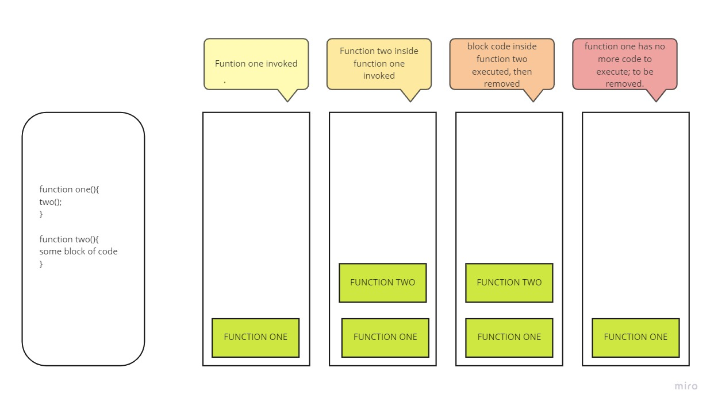

# 10. In Memory Storage

## Why is this important:

Knowing how the call stack works can help us when writing code. 

-----

## Javascript Call Stack

Call stack is used for functions calls. It's a data structure that uses Last in, First out(LIFO) for temporary storage and managing functions invocations(call).

- LIFO = last function in stack is the first to pop out when the function returns. 

- Synchronous call stack: Execution of functions are done one at a time, from top to bottom

-----

1. What is a ‘call’?

    - a data structure that uses Last in, First out(LIFO) for temporary storage and managing functions invocations(call).

2. How many ‘calls’ can happen at once?

    - one
3. What does LIFO mean?

    - LIFO = last function in stack is the first to pop out when the function returns.

4. Draw an example of a call stack and the functions that would need to be invoked to generate that call stack.

    - 

5. What causes a Stack Overflow?

    - A stack overflow occurs when there is a recursive function (a function that calls itself) without an exit point.

## Error Messages

1. Reference: using variable thats not declared

2. Syntax: incorrect syntax

3. Range: invalid length

4. Type: usage or access of incompatible types

5. Breakpoints are points we can add to debug specific lines of code 

6. Adding the *debugger* statement allows you to see the history before reaching the breakpoint.

-----

### Things I want to know more about:

I want to get acquainted with debugging tools with on VS code.

### Resources 
[JS Call Stack](https://medium.freecodecamp.org/understanding-the-javascript-call-stack-861e41ae61d4)

[Error Messages Debugging](https://codeburst.io/javascript-error-messages-debugging-d23f84f0ae7c)

📔[Back to Main Page](../README.md)